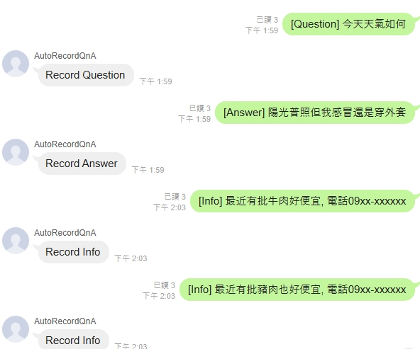
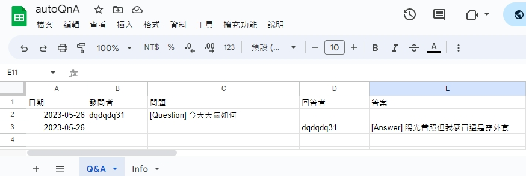
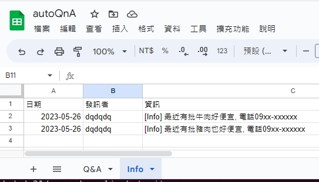
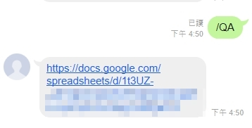
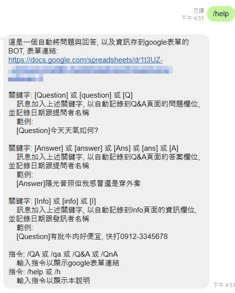

# LINE Q&A 及 Info 紀錄機器人 （ Record Q&A and Info Bot ）
自動將含有關鍵字的訊息丟到google表單裡

## Features

- 自動識別包含關鍵字 [Question] 或 [question] 或 [Q] 的訊息，並將 日期，LINE 名稱，訊息內容，記錄到表單 Q&A 頁面裡的問題欄位
- 自動識別包含關鍵字 [Answer] 或 [answer] 或 [Ans] 或 [ans] 或 [A] 的訊息，並將 日期，LINE 名稱，訊息內容，記錄到表單 Q&A 頁面裡的答案欄位
- 自動識別包含關鍵字 [Info] 或 [info] 或 [I] 的訊息，並將 日期，LINE 名稱，訊息內容，記錄到表單 Info 頁面裡的資訊欄位
- 搭配 Google 試算表做免費資料庫，快速好用
- 使用 Google App Script 語法開發

## Command description
- /help or /h
> show help
- /QA or /qa or /Q&A or /QnA
> show google sheet link url

## Demo
1. Send message with keyword in line

2. The question and answer wiil be stored in google Q&A sheet

3. The information wiil be stored in google Info sheet

4. Show google sheet url

5. Show help

## Reference
- [Github](https://github.com/jschang19/plusone-linebot)
- [點我看加一 LIND BOT 自訂教學](https://jcshawn.com/addone-linebot/)
- [用 Line Bot 來搜尋 Google 試算表的資料 - (02)Line Bot 設定 | Boris 的分享小站](https://www.youtube.com/watch?v=Bjg_vZnDHbc)
- [LINE 官方 Messaging API 開發文件](https://developers.line.biz/zh-hant/docs/messaging-api/)
- [Google App Script 開發文件](https://developers.google.com/apps-script/reference/document)
- [How to get the current time in Google spreadsheet using script editor?](https://stackoverflow.com/questions/10182020/how-to-get-the-current-time-in-google-spreadsheet-using-script-editor)

## License
MIT License
歡迎自行運用此份專案於商業與個人用途，如果你願意標記我為出處的話，將對我是莫大的鼓勵，感謝！
Feel free to fork this project and use it for your own work. However, it would be great if you credit me.

